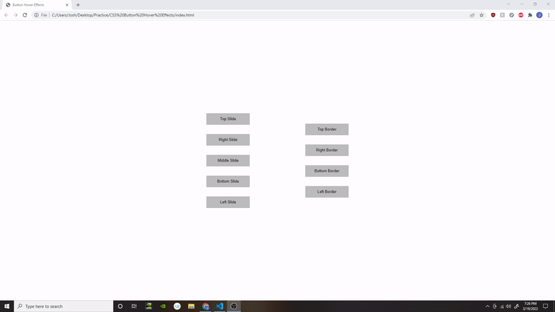

# CSS Button Hover Effects
I was messing around with some cool button hover effects I found online, and decided to upload it to Github so anyone can view and use them in their own projects. These effects look clean and professional, and you can create them just by using pure HTML/CSS. 

### Prerequisites

In order to clone and view the files in this repository, you'll need to have a code editor, and you'll need to have git installed

## Getting Started
If you have your SSH keys connected to Github, you can view and edit the files you can clone the repo from github using the following command:

```
git clone git@github.com:JoshGumperz/CSS-Button-Hover-Effects.git
```

Otherwise, you can still clone the repo down using this command: 

```
git clone https://github.com/JoshGumperz/CSS-Button-Hover-Effects.git
```

After cloning the repo, you should be able to open up the index.html file in your browser and start messing around with the code. 

## Usage Tutorial
The CSS Code is surrounded by descriptive comments that explain which styles to apply for which types of animations you want to use. 

Follow along with the comments, and pick and choose which styles you want to implement into whatever project you're working on to get your desired effect. 

## Site Picture



## Built With
* [HTML](https://developer.mozilla.org/en-US/docs/Web/HTML)
* [CSS](https://developer.mozilla.org/en-US/docs/Web/CSS)

## Authors

**Josh Gumperz** 

- [Link to Github](https://github.com/JoshGumperz)
- [Link to LinkedIn](https://www.linkedin.com/in/josh-gumperz-8706a8185/)

## License

This project is licensed under the MIT License 